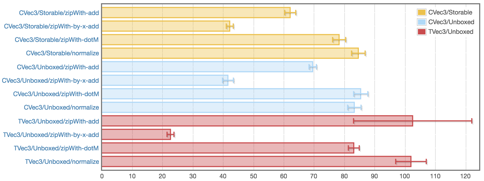

# simple-vec3

[](https://travis-ci.org/dzhus/simple-vec3)
[](https://hackage.haskell.org/package/simple-vec3)
[](http://packdeps.haskellers.com/feed?needle=simple-vec3)

*Simple* three-dimensional vectors of doubles with basic vector and
matrix operations, supporting `Data.Vector.Unboxed` and
`Data.Vector.Storable`.

```haskell
>>> let v1 = (-1, 0.0,  0.2) :: TVec3
>>> let v2 = ( 1, 2.3,  5.0) :: TVec3
>>> let v3 = ( 1,   1, -0.2) :: TVec3

-- Add two vectors:
>>> v1 <+> v2
(0.0, 2.3, 5.2)

-- Dot product:
>>> v1 .* v2
0.0

-- Multiply by a scalar:
>>> v1 .^ 5
(-5.0, 0.0, 1.0)

-- Cross product:
>>> v1 >< v3
(-0.2, 0.0, -1.0)

-- Matrix-vector product:
>>> diag 2 `mxv` v2
(2.0, 4.6, 10.0)
```

Please consult the [Hackage page for simple-vec3][hackage-doc] for full
documentation.

The package provides two different implementations for `Vec3` type
class, which differ in storage scheme. Benchmarks are included for
both. You most likely want to use `CVec3` which is based on contiguous
storage scheme and offers the best performance.



## Alternatives

This package was written to explore and benchmark different array
storage schemes in Haskell, as supported by `vector` library. Several
alternatives with more extensive APIs exist:

- [AC-Vector][]

- [GlomeVec][]

[hackage-doc]: https://hackage.haskell.org/package/simple-vec3/docs/Data-Vec3.html

[ac-vector]: https://hackage.haskell.org/package/AC-Vector

[glomevec]: https://hackage.haskell.org/package/GlomeVec
